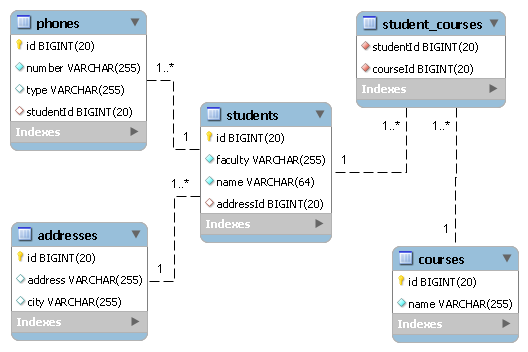

JPA Student Demo Application
===================================

This tutorial shows how can be used __Java Persistence API (JPA)__ to implement basic CRUD operations on a database.


Database configuration
----------------------
In order to run this application you must create a MySQL database called `jpastudent`:

```sql
CREATE DATABASE jpastudent CHARACTER SET utf8 COLLATE utf8_bin;
```
Optionally, you can add a database user to connect to database. In our case we use default `root` without password. 

The database connection details can be changed from file `src/main/resources/META-INF/persistence.xml`:

```xml 
<?xml version="1.0" encoding="UTF-8"?>
<persistence version="2.2"
  xmlns="http://xmlns.jcp.org/xml/ns/persistence" xmlns:xsi="http://www.w3.org/2001/XMLSchema-instance"
  xsi:schemaLocation="http://xmlns.jcp.org/xml/ns/persistence
                                 http://xmlns.jcp.org/xml/ns/persistence/persistence_2_2.xsd">

  <persistence-unit name="student-punit" transaction-type="RESOURCE_LOCAL">
	<provider>org.hibernate.jpa.HibernatePersistenceProvider</provider>
    <properties>
      <!-- Configuring JDBC properties -->
      <property name="javax.persistence.jdbc.url" value="jdbc:mysql://localhost:3306/jpastudent" />
      <property name="javax.persistence.jdbc.user" value="root" />
      <property name="javax.persistence.jdbc.password" value="" />
      <property name="javax.persistence.jdbc.driver" value="com.mysql.cj.jdbc.Driver" />

      <!-- Hibernate properties -->
      <property name="hibernate.dialect" value="org.hibernate.dialect.MySQL8Dialect" />
      <!-- property name="hibernate.dialect" value="org.hibernate.dialect.MariaDBDialect" /-->
      <property name="hibernate.hbm2ddl.auto" value="create" /> <!-- Use value="update" if you want to keep existing data -->
      <property name="hibernate.format_sql" value="true" />
      <property name="hibernate.show_sql" value="false" /> <!-- Use value="true" if you want to display SQL queries -->
      <property name="hibernate.connection.release_mode" value="on_close" />
    </properties>
  </persistence-unit>

</persistence>
```

Database Schema
---------------
The following image shows the database schema used in this application: 



A _student_ has an address and one or more _phones_. Each _student_ is enrolled to a set of _courses_.
