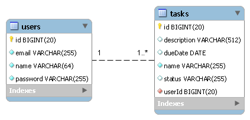

ToDo List - Spring MVC Web application (Bootstrap Interface Version)
======================================

Application Description
-----------------------
In this tutorial is implemented a web application that keeps the list of tasks assigned to a set of users.

Each _task_ is associated with a _user_ and is defined by the following characteristics:

* _Task Name_ - a short task description;
* _Task Due Date_ - the date when task must be completed;
* _Task Description_ - full description of task
* _Task Status_ - It can have one of the values:
  + _not started_
  + _in progress_ 
  + _completed_
* _Assigned user_ - the task responsible person.

A _user_ is characterized by the following attributes:

* _Name_ - the user name;
* _Email_ - the user email;
* _Password_ - the user password.
  
The following image shows the database schema used in this application: 



 
The current version of application do not implement an authentication mechanism but in the future we plan to add this feature.

The application must provide the following operations:

1. Users management: list, add, update, delete 
2. Tasks management: list, add, update, delete    

Technologies
------------

* Spring 5
* Spring MVC 5
* JPA 2.2
* Bootstrap 3
* JSP 
* JSTL 1.2
* JDK 1.8
* MySQL
* Spring Tool Suite 
* Maven 3
* Tomcat 8+

Application Setup
-----------------

In order to run this application you must create a MySQL database called `db_todo`:

```sql
CREATE DATABASE db_todo CHARACTER SET utf8 COLLATE utf8_bin;
```
Optionally, you can add a database user to connect to database. In our case we use default `root` without password. 

The database connection details can be changed from file `src/main/resources/jpaContext.xml`:

```xml 
<!-- The database connection details -->
<bean id="dataSource" class="org.springframework.jdbc.datasource.DriverManagerDataSource">
    <property name="driverClassName" value="com.mysql.cj.jdbc.Driver" />
    <property name="url" value="jdbc:mysql://localhost:3306/db_todo?autoReconnect=true" />
    <property name="username" value="root" />
    <property name="password" value="" />
</bean>
```

In order to run application using Maven you can use the following command:

```bash
    mvn jetty:run
```
This command launches _Maven Embeded Jetty_, and next, open in your favorite browser the following address: [http://localhost:8000/todo/](http://localhost:8000/todo/)